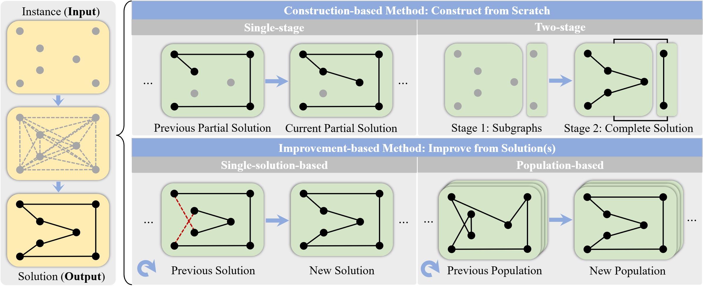
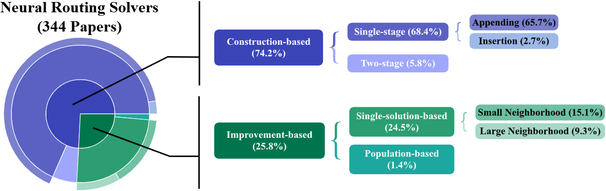
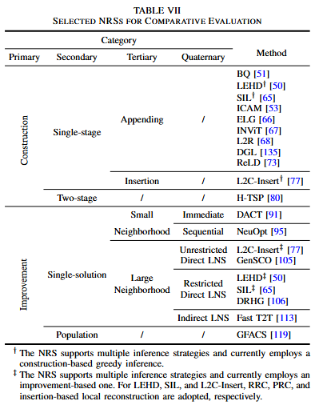

# Survey on Neural Routing Solvers

This repository contains the detailed experiment implementation and results of the paper "Survey on Neural Routing Solvers".

Neural routing solvers (NRSs) that leverage deep learning to tackle vehicle routing problems have demonstrated notable potential for practical applications. By learning implicit heuristic rules from data, NRSs replace the handcrafted counterparts in classic heuristic frameworks, thereby reducing reliance on costly manual design and trial-and-error adjustments. This survey makes two main contributions: 

(1) The heuristic nature of NRSs is highlighted, and existing NRSs are reviewed from the perspective of heuristics. A hierarchical taxonomy based on heuristic principles is further introduced. 

(2) A generalization-focused evaluation pipeline is proposed to address limitations of the conventional pipeline. Comparative benchmarking of representative NRSs across both pipelines uncovers a series of previously unreported gaps in current research.





## A Brief Introduction to the Experiment

This experiment investigates the **in-problem** performance of representative NRSs, with a focus on their **zero-shot generalization** ability, a topic of significant interest in recent years. The conventional evaluation pipeline is first applied, which emphasizes scalability on synthetic instances and yields promising results. Nevertheless, this pipeline suffers from notable limitations, including a narrow range of test distributions, conflated in- and out-of-distribution comparisons, and inconsistent inference settings. Therefore, a new generalization-focused evaluation pipeline is introduced for single-model generalization across diverse benchmark instances, with unified inference and complementary metrics. Experimental results under this new pipeline reveal that NRSs trained on narrowly distributed data may be outperformed by even simple construction heuristics such as nearest neighbor and random insertion. This contrast suggests that the conventional pipeline can systematically lead to overly optimistic conclusions. Building on these findings, the advantages of the proposed pipeline are discussed, and principles for method selection are outlined. In particular, learning is argued to remain crucial for NRSs, even when their performance falls short of prior expectations.

<u>***Beyond the NRSs already evaluated, we welcome benchmarking additional untested NRSs under both pipelines and comparing their results!***</u>

### Selected Methods in the Experiments

The comparative analysis encompasses representative heuristics (as baselines) and NRSs. The **heuristics** chosen for efficiency or effectiveness are briefly introduced below.

- **Nearest Neighbor**: A classic construction-based heuristic. At each step, the nearest node to the last node of the partial solution is selected for appending.
- **Random Insertion**: A classic construction-based heuristic. At each step, a randomly selected node is inserted into the partial solution at the position that minimizes the increase in cost.
- **LKH-3**: A single-solution-based SOTA heuristic for TSP, widely adopted as a baseline in prior works.
- **HGS**: A population-based SOTA heuristic for CVRP, widely adopted as a baseline in prior works.
- **AILS-II**: A single-solution-based SOTA heuristic for CVRP, rarely adopted as a baseline in prior works.

The selected **NRSs** comprehensively cover all categories in the proposed taxonomy and are listed in the Table below. All inference experiments of NRSs are uniformly conducted on a single NVIDIA GeForce RTX 3090 GPU with 24GB of memory. Specifically, 20 cores of the Intel(R) Xeon(R) Gold 6348 CPU @ 2.60GHz and 40 GB of memory are allocated to each NAR NRS (GFACS, GenSCO, and Fast T2T) for potential calculations on the CPU.




### The Conventional Pipeline

The conventional pipeline generally evaluates NRSs on synthetic instances with specific scales, node distributions, and optional constraint tightness. Among these aspects,  **scalability** is the most widely studied one and is also the primary focus of this experiment. It is important to note, however, that **scalability is not equivalent to generalization**.

#### Experimental Settings

- Problem and Instance: only TSP
  - Scale: 100, 1K, 10K
  - Uniform Distribution
- Metrics: 
  - Gap
  - Total inference time
- Inference
  - Relying on the released implementations and pretrained models with default configurations

Each NRS with a specific configuration is ***<u>only evaluated on</u>*** instances with ***<u>corresponding sizes reported in the original studies</u>***!


### The Proposed Pipeline

#### Experimental Purpose

- Limitations of the conventional pipeline
  - Limited testing distribution
  - Mixed evaluation of ***<u>single-model generalization</u>*** and ***<u>multi-model in-distribution</u>*** performance
  - Inconsistent inference setting
- Features of the proposed pipeline
  - Centering on the ***<u>zero-shot in-problem generalization</u>***
  - Diverse instances
  - Standardized Inference settings

#### Experimental Settings

- Problem and Instance: **TSP** and **CVRP** instances
  - Scale:  (0,100K]
  - Edge-weight types: **EUC_2D** or **CEIL_2D**
  - BKS available
  - No additional constraints
  - Sources
    - TSPLIB: 77 **EUC_2D** + 4 **CEIL 2D**
    - National: 27 **EUC_2D**
    - VLSI: 98 **EUC_2D**
    - Dataset of The 8th DIMACS Implementation Challenge (TSP): 22 **EUC_2D** generated clustered ones
    - CVRPLIB
      - Set X: 100 **EUC_2D**
      - Set AGS: 10 **EUC_2D**
- Aspects and Metrics
  - Effectiveness: avg gap
  - Efficiency: avg time
  - Reliability: the solvable count
    - Unsolvable
      - OOM
      - Performance Breakdowns: gap$\geq$100%
      - Timeouts: per-instance runtime beyond 36,000s
- Inference
  - Greedy
  - **Not** allowed
    - Special decoding strategies: beam search, sampling, etc.
    - Data augmentation
    - Fine-tuning
    - Additional local search
  - Other configurations are kept at their method-specific defaults


## Implementation

### Results Reported in the Paper

Please locate the results in the folder corresponding to each method's specific category. The only exception is **Random Insertion**: since **SIL** uses it for initialization, run or review this method under the **SIL** folder. The results should be filtered using the *filter_log.py* file if unsolvable conditions are also reported.

### Dependencies

Please refer to `requirements.txt`. Note that GenSCO has dependency conflicts with other methods, whose dependencies are provided in `requirements_gensco.txt`.

### Model & Data

- Inference

  - Models: All pre-trained models should be placed in the correct location according to each NRS's official implementation.
  - Data: Please download test sets from Google Drive https://drive.google.com/drive/folders/1_MI7COFGx0gcKmcgNhdPyRbp0JjE-1O_?usp=sharing, and place them in `./0_data_survey`.

### Further Improvement

If there are any issues in running or re-implementing the code, please contact the authors Yunpeng Ba (bayp2024@mail.sustech.edu.cn) and Changliang Zhou (zhoucl2022@mail.sustech.edu.cn) in a timely manner.

## Citation

 **If this repository is helpful for your research, please cite our paper:**

```
@article{ba2026survey,
  title={Survey on Neural Routing Solvers},
  author={Ba, Yunpeng and Lin, Xi and Zhou, Changliang and Zheng, Ruihao and Wang, Zhenkun and Liang, Xinyan and Lu, Zhichao and Sun, Jianyong and Qian, Yuhua and Zhang, Qingfu},
  journal={arXiv preprint arXiv:2602.21761},
  year={2026}
}
```

## Acknowledgements

The code implementation is based on the code of the following methods and the sources of the following datasets.
Thanks for their implementations.

### Sources of the Adopted Methods

| Method     | Link                                                         | License                             |
| ---------- | ------------------------------------------------------------ | ----------------------------------- |
| LKH-3      | http://webhotel4.ruc.dk/~keld/research/LKH-3/                | Available for academic research use |
| HGS        | https://github.com/vidalt/HGS-CVRP                           | MIT License                         |
| AILS-II    | https://github.com/INFORMSJoC/2023.0106                      | MIT License                         |
| BQ         | https://github.com/naver/bq-nco                              | CC BY-NC-SA 4.0 license             |
| LEHD       | https://github.com/CIAM-Group/NCO_code/tree/main/single_objective/LEHD | MIT License                         |
| SIL        | https://github.com/CIAM-Group/SIL                            | MIT License                         |
| ICAM       | https://github.com/CIAM-Group/ICAM                           | MIT License                         |
| ELG        | https://github.com/gaocrr/ELG                                | MIT License                         |
| INViT      | https://github.com/Kasumigaoka-Utaha/INViT                   | MIT License                         |
| L2R        | https://github.com/CIAM-Group/L2R                            | MIT License                         |
| DGL        | https://github.com/wuyuesong/DGL                             | Available for academic research use |
| ReLD       | https://github.com/ziweileonhuang/reld-nco                   | MIT License                         |
| L2C-Insert | https://github.com/CIAM-Group/L2C_Insert                     | MIT License                         |
| H-TSP      | https://github.com/Learning4Optimization-HUST/H-TSP          | MIT License                         |
| DACT       | https://github.com/yining043/VRP-DACT                        | MIT License                         |
| NeuOpt     | https://github.com/yining043/NeuOpt                          | MIT License                         |
| GenSCO     | https://github.com/Thinklab-SJTU/GenSCO                      | Available for academic research use |
| DRHG       | https://github.com/CIAM-Group/DRHG                           | Available for academic research use |
| FastT2T    | https://github.com/Thinklab-SJTU/Fast-T2T                    | MIT license                         |
| GFACS      | https://github.com/ai4co/gfacs                               | MIT license                         |

### Sources of the Adopted Benchmarks

| Benchmark                           | Instance                                                     | BKS                                                          |
| ----------------------------------- | ------------------------------------------------------------ | ------------------------------------------------------------ |
| TSPLIB                              | http://comopt.ifi.uni-heidelberg.de/software/TSPLIB95/       | http://comopt.ifi.uni-heidelberg.de/software/TSPLIB95/STSP.html |
| National                            | https://www.math.uwaterloo.ca/tsp/world/countries.html       | https://www.math.uwaterloo.ca/tsp/world/summary.html         |
| VLSI                                | https://www.math.uwaterloo.ca/tsp/vlsi/index.html            | https://www.math.uwaterloo.ca/tsp/vlsi/summary.html          |
| 8th DIMACS Implementation Challenge | http://dimacs.rutgers.edu/archive/Challenges/TSP/download.html | http://webhotel4.ruc.dk/~keld/research/LKH/DIMACS_results.html & http://dimacs.rutgers.edu/archive/Challenges/TSP/opts.html |
| CVRPLIB                             | https://galgos.inf.puc-rio.br/cvrplib/index.php/en/instances | Provided in the corresponding `.vrp` files of the instances. |


## Copyright (c) 2026 CIAM Group

**The code can only be used for non-commercial purposes. Please contact the authors if you want to use this code for business matters.**
